# Empresa Viva

**O caixa e as pessoas da empresa num lugar só.** Fluxo de caixa explicado mês a mês, a jornada de cada colaborador desde a contratação e o teste DISC respondido pelo celular, dentro da ficha.

Feito para donos de empresas pequenas e médias (comércio, transportadora, clínica), para o financeiro e o RH delas e para a consultoria que acompanha várias empresas ao mesmo tempo.

**[Abrir a demonstração](https://empresa-viva.vercel.app)** · entre por um dos perfis (Dono, Financeiro, RH ou Consultora), sem senha. Tudo o que aparece é fictício.

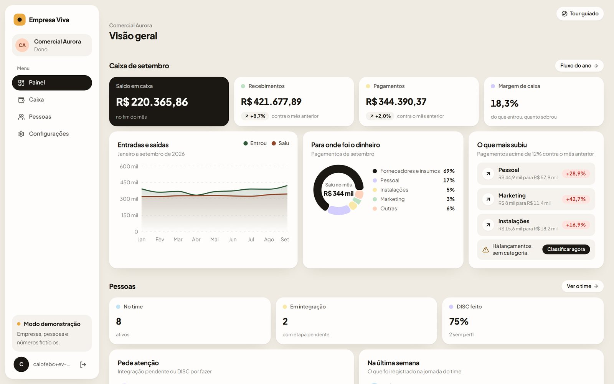

---

## O problema

Numa empresa pequena, a informação existe, só que espalhada. O caixa vira uma apostila que chega no mês seguinte, quando a decisão já passou, e alguém escreve à mão por que cada gasto subiu. A história de cada colaborador fica dividida entre pasta, planilha e um teste de perfil contratado por fora, que volta como um PDF que ninguém abre de novo. Ninguém enxerga o todo.

## O que o sistema faz

**Caixa**
- Importa a planilha exportada do sistema que a empresa já usa (Excel ou CSV). Acha as colunas sozinho, entende data brasileira e número com vírgula e lê CSV salvo pelo Excel do Windows sem quebrar acento.
- Classifica cada lançamento por regras ("se a descrição contém X, vai para Y"). O que a regra não reconhece cai numa fila, que se classifica em um clique ou vira regra nova.
- Fluxo do ano categoria por categoria, com saldo inicial, resultado da operação e saldo final.
- Comparação de qualquer mês com o anterior, com semáforo: pagamento que subiu mais de 12% acende vermelho.
- Curva 80/20 dos pagamentos e gráfico de entradas e saídas.

**Pessoas**
- Ficha de cada colaborador com a linha do tempo: contratação, mudança de função, treinamento, avaliação, férias e desligamento.
- Integração em etapas configuráveis pela empresa.
- **DISC dentro do sistema:** o RH manda o link pelo WhatsApp, a pessoa responde 24 perguntas no celular e o perfil entra sozinho na ficha, com os quatro fatores.

**Para cada papel, só o que é dele**
- Dono vê tudo. Financeiro só o caixa. RH só as pessoas. A consultora acompanha várias empresas e escolhe qual abrir.
- A trava fica no banco (Row Level Security no Postgres), não só na tela.

**Primeira visita guiada**
- Um tour interativo abre na primeira entrada, destaca uma parte por vez e pede para clicar onde precisa. O botão "Tour guiado" no alto abre de novo quando quiser.

## Telas

| | |
|---|---|
| 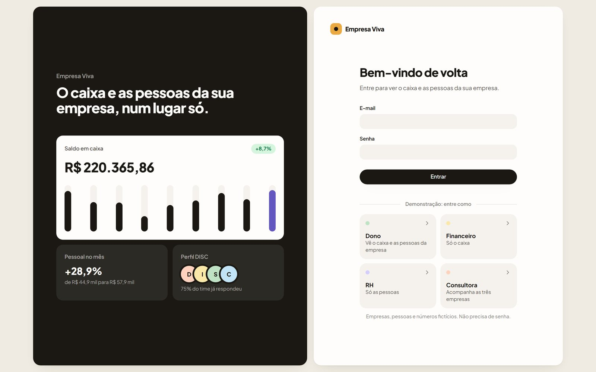 | 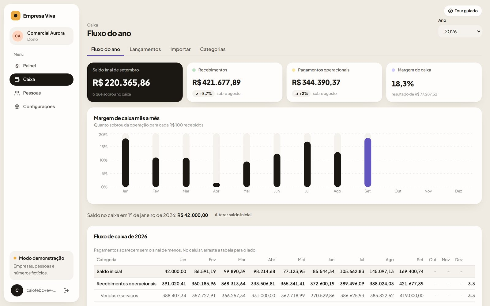 |
| Entrada com prévia do sistema e perfis da demonstração | Fluxo do ano, margem de caixa mês a mês |
| 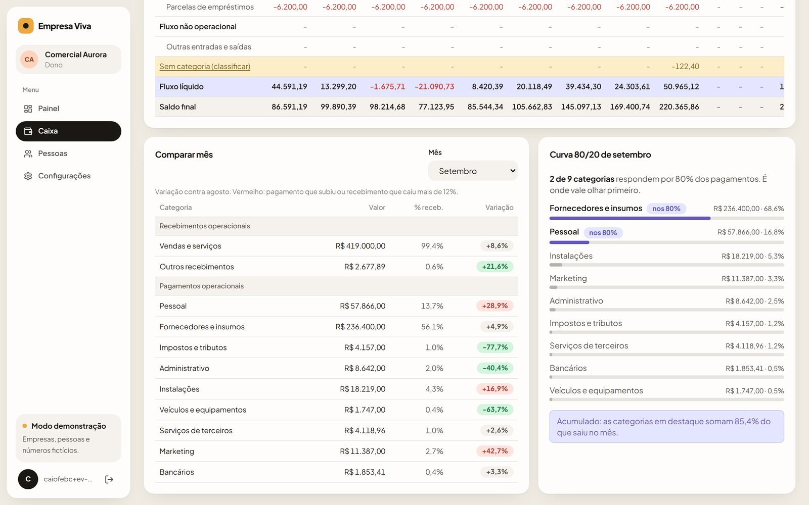 | 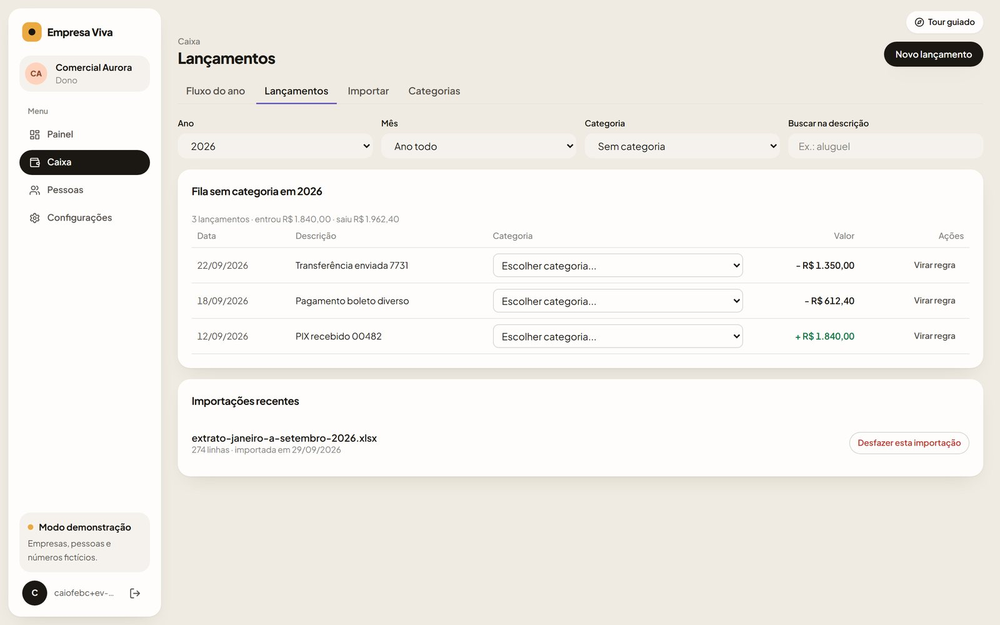 |
| Comparar mês com semáforo e curva 80/20 | Fila do que a regra não reconheceu |
| 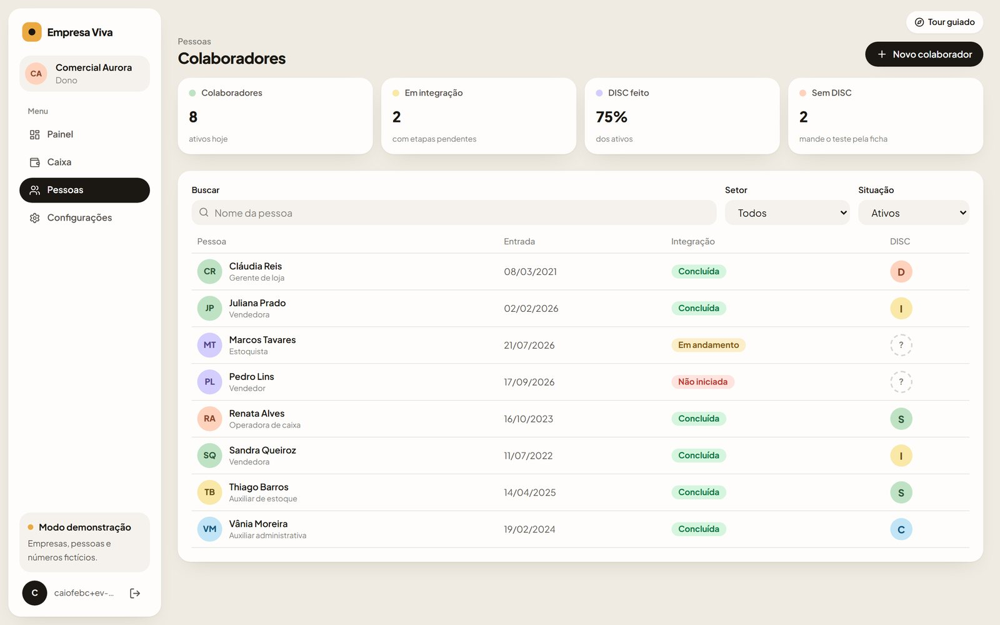 | 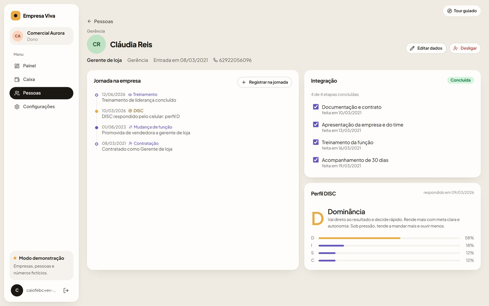 |
| O time com integração e perfil DISC | Ficha: jornada, etapas e DISC |
| 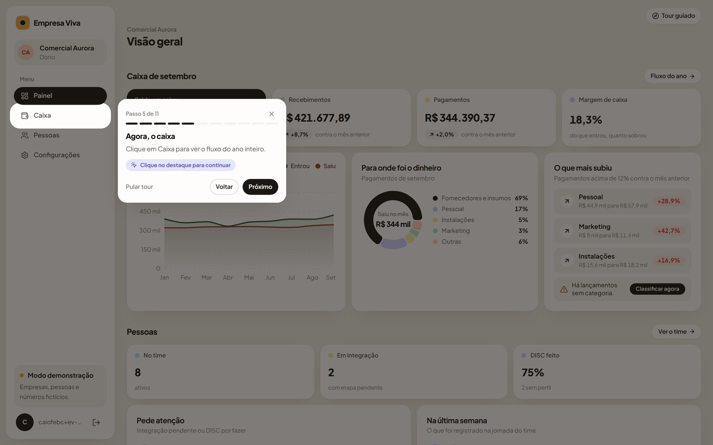 | 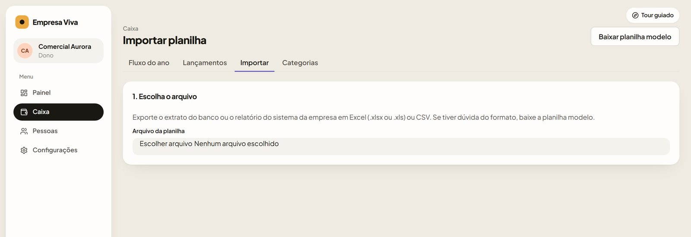 |
| Tour guiado com passos de clique | Importação da planilha da empresa |

**No celular**

<p>
  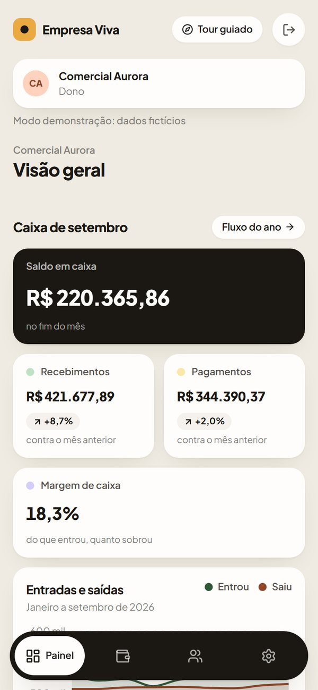
  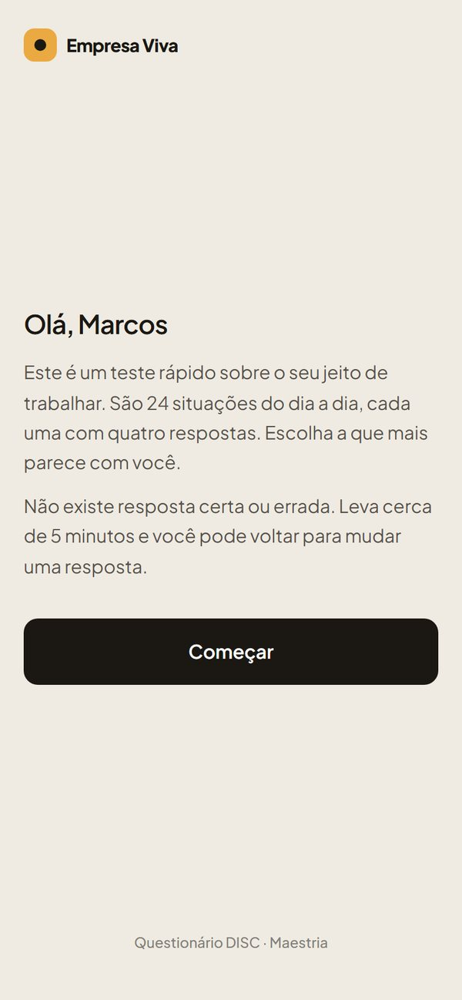
  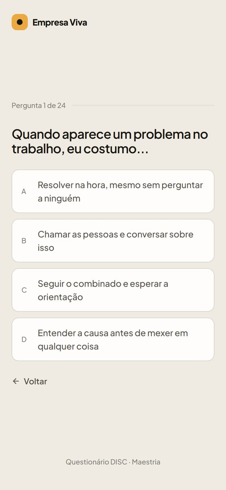
</p>

## Como é feito

| | |
|---|---|
| Front | React 19, Vite, TypeScript estrito, Tailwind v4, React Router, TanStack Query, Recharts |
| Banco | Supabase (Postgres, Auth e Row Level Security), tudo num schema próprio (`empresa_viva`) |
| Planilhas | SheetJS e PapaParse, com leitura de CSV em UTF-8 ou windows-1252 |
| Testes | Vitest e Testing Library no app; pgTAP no banco, rodando no GitHub Actions a cada push |
| Publicação | Vercel |

**Decisões que valem a leitura**
- **Acesso travado no banco.** Cada tabela confere o papel da pessoa naquela empresa antes de devolver uma linha. Um usuário logado que não é membro de nada não enxerga nada, mesmo chamando a API direto. As chaves estrangeiras compostas impedem ligar um lançamento de uma empresa a uma categoria de outra.
- **DISC público sem abrir o banco.** O teste roda sem login por duas funções que só aceitam o token do convite, gravam uma vez só e recalculam o resultado no servidor.
- **Cálculo testável.** O fluxo de caixa, a variação, o semáforo e a curva 80/20 são funções puras em TypeScript, conferidas contra uma conta feita à mão.
- **Modo de demonstração vindo do banco.** Uma tabela diz se o ambiente é demonstração ou real. Virar para real apaga as empresas de exemplo e os usuários da demo de uma vez.

## Qualidade

- 141 testes do app e 106 testes de banco (trava de acesso por papel, gatilhos, DISC e demonstração).
- `tools/testar-fluxos.mjs` percorre 11 fluxos pela tela num Chrome de verdade: importar e desfazer, lançar, classificar, criar regra, cadastrar pessoa, integração, DISC pelo celular, desligar, configurações, permissões e celular. No fim, apaga o que criou e confere que a demonstração voltou ao estado de antes.
- `tools/testar-tour.mjs` percorre o tour guiado clicando passo a passo, no computador e no celular.
- `npm run verificar` junta tipos, testes, build e uma varredura que reprova segredo em arquivo.

## Rodar localmente

```bash
npm install
cp .env.example .env.local     # URL e chave pública do seu Supabase
npm run dev                    # http://localhost:5174
```

O banco nasce das migrations em `supabase/migrations`. A demonstração com três empresas fictícias sai de `node tools/gerar-demonstracao.mjs`, que escreve `supabase/demonstracao.sql`.

---

Desenvolvido pela [Maestria](https://maestriapro.com.br). Código publicado como portfólio; todos os direitos reservados.
